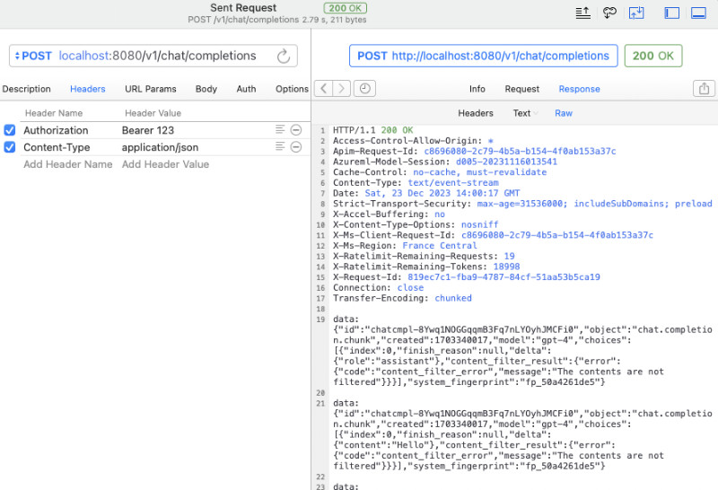

# Amazing OpenAI API


Convert different model APIs into the OpenAI API format out of the box.

10MB+的小工具，能够将各种不同的模型 API 转换为开箱即用的 OpenAI API 格式。

当前支持模型：

- Azure OpenAI API (GPT 3.5/4), GPT4 Vision (GPT4v)
- YI 34B API
- Google Gemini Pro


## 下载 📦

访问 [GitHub Release 页面](https://github.com/soulteary/amazing-openai-api/releases)，下载适合你的操作系统的执行文件。


或者使用 Docker Pull，下载指定版本的镜像文件：

```bash
docker pull soulteary/amazing-openai-api:v0.7.0
```

## 快速上手

`AOA` 不需要编写任何配置文件，通过指定环境变量就能够完成应用行为的调整，包括“选择工作模型”、“设置模型运行需要的参数”、“设置模型兼容别名”。

默认执行 `./aoa` ，程序会将工作模型设置为 `azure`，此时我们设置环境变量 `AZURE_ENDPOINT=https://你的部署名称.openai.azure.com/` 然后就可以正常使用服务啦。

```bash
AZURE_ENDPOINT=https://你的部署名称.openai.azure.com/ ./aoa
```

如果你更喜欢 Docker，可以用下面的命令：

```bash
docker run --rm -it -e AZURE_ENDPOINT=https://你的部署名称.openai.azure.com/ -p 8080:8080 soulteary/amazing-openai-api:v0.7.0
```

当服务启动之后，我们就可以通过访问 `http://localhost:8080/v1` 来访问和 OpenAI 一样的 API 服务啦。

你可以使用 `curl` 来进行一个快速测试：

```bash
curl -v http://127.0.0.1:8080/v1/chat/completions \
    -H "Content-Type: application/json" \
    -H "Authorization: Bearer 123" \
    -d '{
        "model": "gpt-4",
        "messages": [
        {
            "role": "system",
            "content": "You are a poetic assistant, skilled in explaining complex programming concepts with creative flair."
        },
        {
            "role": "user",
            "content": "Compose a poem that explains the concept of recursion in programming."
        }
        ]
    }'
```

也可以使用 OpenAI 官方 SDK 进行调用，或者任意兼容 OpenAI 的开源软件进行使用（更多例子，参考 [example](./example/)）：

```python
from openai import OpenAI

client = OpenAI(
    api_key="your-key-or-input-something-as-you-like",
    base_url="http://127.0.0.1:8080/v1"
)

chat_completion = client.chat.completions.create(
    messages=[
        {
            "role": "user",
            "content": "Say this is a test",
        }
    ],
    model="gpt-3.5-turbo",
)

print(chat_completion)
```

你如果你希望不要将 API Key 暴露给应用，或者不放心各种复杂的开源软件是否有 API Key 泄漏风险，我们可以多配置一个 `AZURE_API_KEY=你的 API Key` 环境变量，然后各种开源软件在请求的时候就无需再填写 API key 了（或者随便填写也行）。

当然，因为 Azure 的一些限制，以及一些开源软件中的模型调用名称不好调整，我们可以通过下面的方式，来将原始请求中的模型，映射为我们真实的模型名称。比如，将 GPT 3.5/4 都替换为 `yi-34b-chat`：

```bash
gpt-3.5-turbo:yi-34b-chat,gpt-4:yi-34b-chat
```

如果你希望使用 `yi-34b-chat`，或者 `gemini-pro`，我们需要设置 `AOA_TYPE=yi` 或者 `AOA_TYPE=gemini`，除此之外，没有任何差别。

## 容器快速上手

项目中包含当前支持的三种模型接口的 `docker compose` 示例文件，我们将 `example` 目录中的不同的文件，按需选择使用，将必填的信息填写完毕后，将文件修改为 `docker-compose.yml`。

然后使用 `docker compose up` 启动服务，就能够快速使用啦。

- [docker-compose.azure.yml](./example/docker-compose.azure.yml)
- [docker-compose.azure-gpt4v.yml](./example/docker-compose.azure-gpt4v.yml)
- [docker-compose.yi.yml](./example/docker-compose.yi.yml)
- [docker-compose.gemini.yml](./example/docker-compose.gemini.yml)

## 详细配置使用

调整工作模型 `AOA_TYPE`，可选参数，默认为 `azure`：

```bash
# 选择一个服务, "azure", "yi", "gemini"
AOA_TYPE: "azure"
```

程序服务地址，可选参数，默认为 `8080` 和 `0.0.0.0`：

```bash
# 服务端口，默认 `8080`
AOA_PORT: 8080
# 服务地址，默认 `0.0.0.0`
AOA_HOST: "0.0.0.0"
```

## Azure 使用

如果我们想将 Azure 上部署的 OpenAI 服务转换为标准的 OpenAI 调用，可以用下面的命令：

```bash
AZURE_ENDPOINT=https://<你的 Endpoint 地址>.openai.azure.com/ AZURE_API_KEY=<你的 API KEY> AZURE_MODEL_ALIAS=gpt-3.5-turbo:gpt-35 ./amazing-openai-api 
```

在上面的命令中 `AZURE_ENDPOINT` 和 `AZURE_API_KEY` 包含了 Azure OpenAI 服务中的核心要素，因为 Azure 部署 GPT 3.5 / GPT 4 的部署名称不允许包含 `.`，所以我们使用 `AZURE_MODEL_ALIAS` 将我们**请求内容中的模型名称**替换为真实的 Azure 部署名称。甚至可以使用这个技巧将各种开源、闭源软件使用的模型自动映射为我们希望的模型：

```bash
# 比如不论是 3.5 还是 4 都映射为 `gpt-35`
AZURE_MODEL_ALIAS=gpt-3.5-turbo:gpt-35,gpt-4:gpt-35
```

因为我们已经配置了 `AZURE_API_KEY`，所以开源软件也好，使用 `curl` 调用也罢，都不需要添加 `Authorization: Bearer <你的 API Key>` （也可以随便写），这样就起到了严格的 API Key 隔离，提升了 API Key 的安全性。



如果你还是习惯在请求头参数中添加认证内容，可以使用下面的不包含 `AZURE_API_KEY` 的命令，程序将透传验证到 Azure 服务：

```bash
AZURE_ENDPOINT=https://<你的 Endpoint 地址>.openai.azure.com/ AZURE_MODEL_ALIAS=gpt-3.5-turbo:gpt-35 ./amazing-openai-api 
```

### GPT4 Vision

如果你已经拥有了 Azure GPT Vision，除了使用 SDK 调用之外，你也可以参考这篇文档，使用 `curl` 进行调用：[GPT Vision](./example/gpt-vision.md)。

### 模型参数设置

```bash
# (必选) Azure Deployment Endpoint URL
AZURE_ENDPOINT
# (必选) Azure API Key
AZURE_API_KEY
# (可选) 模型名称，默认 GPT-4
AZURE_MODEL
# (可选) API Version
AZURE_API_VER
# (可选) 是否是 Vision 实例
ENV_AZURE_VISION
# (可选) 模型映射别名
AZURE_MODEL_ALIAS
# (可选) Azure 网络代理
AZURE_HTTP_PROXY
AZURE_SOCKS_PROXY
```

## YI (零一万物)

如果我们想将 YI 官方的 API 转换为标准的 OpenAI 调用，可以用下面的命令：

```bash
AOA_TYPE=yi YI_API_KEY=<你的 API KEY> ./amazing-openai-api 
```

和使用 Azure 服务类似，我们可以使用一个技巧将各种开源、闭源软件使用的模型自动映射为我们希望的模型：

```bash
# 比如不论是 3.5 还是 4 都映射为 `gpt-35`
YI_MODEL_ALIAS=gpt-3.5-turbo:yi-34b-chat,gpt-4:yi-34b-chat
```

如果我们在启动服务的时候配置了 `YI_API_KEY` 的话，不论是开源软件也好，使用 `curl` 调用也罢，我们都不需要添加 `Authorization: Bearer <你的 API Key>` （也可以随便写），这样就起到了严格的 API Key 隔离，提升了 API Key 的安全性。

如果你还是习惯在请求头参数中添加认证内容，可以使用下面的不包含 `YI_API_KEY` 的命令，程序将透传验证到 Yi API 服务：

```bash
./amazing-openai-api 
```

### 模型参数设置

```bash
# (必选) YI API Key
YI_API_KEY
# (可选) 模型名称，默认 yi-34b-chat
YI_MODEL
# (可选) YI Deployment Endpoint URL
YI_ENDPOINT
# (可选) API Version，默认 v1beta，可选 v1
YI_API_VER
# (可选) 模型映射别名
YI_MODEL_ALIAS
# (可选) Azure 网络代理
YI_HTTP_PROXY
YI_SOCKS_PROXY
```

## Gemini PRO

如果我们想将 Google 官方的 Gemini API 转换为标准的 OpenAI 调用，可以用下面的命令：

```bash
AOA_TYPE=gemini GEMINI_API_KEY=<你的 API KEY> ./amazing-openai-api 
```

和使用 Azure 服务类似，我们可以使用一个技巧将各种开源、闭源软件使用的模型自动映射为我们希望的模型：

```bash
# 比如不论是 3.5 还是 4 都映射为 `gpt-35`
GEMINI_MODEL_ALIAS=gpt-3.5-turbo:gemini-pro,gpt-4:gemini-pro
```

如果我们在启动服务的时候配置了 `GEMINI_API_KEY` 的话，不论是开源软件也好，使用 `curl` 调用也罢，我们都不需要添加 `Authorization: Bearer <你的 API Key>` （也可以随便写），这样就起到了严格的 API Key 隔离，提升了 API Key 的安全性。

如果你还是习惯在请求头参数中添加认证内容，可以使用下面的不包含 `GEMINI_API_KEY` 的命令，程序将透传验证到 Google AI 服务：

```bash
./amazing-openai-api
```

### 模型参数设置

```bash
# (必选) Gemini API Key
GEMINI_API_KEY

# (可选) Gemini 安全设置，可选 `BLOCK_NONE` / `BLOCK_ONLY_HIGH` / `BLOCK_MEDIUM_AND_ABOVE` / `BLOCK_LOW_AND_ABOVE` / `HARM_BLOCK_THRESHOLD_UNSPECIFIED`
GEMINI_SAFETY
# (可选) Gemini 模型 版本，默认 `gemini-pro`
GEMINI_MODEL
# (可选) Gemini API 版本，默认 `v1beta`
GEMINI_API_VER
# (可选) Gemini API 接口地址
GEMINI_ENDPOINT
# (可选) 模型映射别名
GEMINI_MODEL_ALIAS
# (可选) Gemini 网络代理
GEMINI_HTTP_PROXY
GEMINI_SOCKS_PROXY
```
